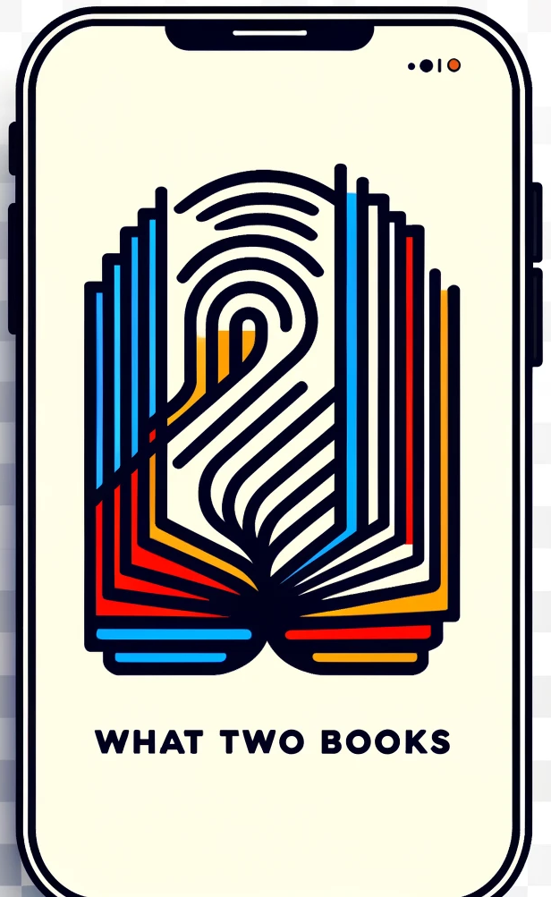

# What Two Books

## Goal

Encourage library patrons to checkout two books that match their interests using a simple web app featuring a simple "thumbs-up" / "thumbs down" interface when presented with two titles over the course of a handful of rounds -- can be performed on a kiosk in the library itself, or via any other device with a web browser and internet connection.

Any two titles presented to the patron must be immediately available for checkout and will display cover image, subject, genre, a brief description along with basic title metadata (title, author(s) publication year, etc).

A receipt of choices are also presented to the patron, and may be printed or saved via QR code (email link?) for future recommendations and possible future outreach.

## Process

### Definitions:

- **`Voting Round`**:  Two titles are presented to the patron. Clearly positioned next to each title are two simple buttons that act as a toggle: 
   - Thumbs-Up (👍)
   - Thumbs-Down (👎)

  A round is completed by either making a 👍/👎 selection on *both* titles, or by selecting "NEXT" for the generation of another round.

- **`Positive / Negative Example`**:  A title that has been given a positive (👍) vote, or a negative (👎) vote by the patron.

- **`Recommendation List`**:  A list of up-to 100 titles that are closer to `Positive Examples` and at the same time further to `Negative Examples`. Filters are always applied to this list. The list is adjusted throughout the `Voting Rounds`.

### Steps:

1. A web application allows to **start a "What Two Books" session** by either touching a book cover in the "idle" state, or selecting one or more **simple filters**:

   - Audience: "All", "Adult", "Teen", "Child" (default: "All")
   - Recent Publication: YES / NO (default: NO)
   - Location: [list of possible pickup locations] (defaults: Kiosk location or home-library)

1. Patrons work their way through each `Voting Round`

   - **The First `Voting Round`** is ALWAYS a random selection of ANY two titles that fit the filters. **Note**:  The First round is **not complete until a patron has selected at least one** `Positive / Negative Example`.
   - **The second, and all following** `Voting Rounds` is a random selection of any two titles appearing in the current `Recommendation List`. (**RESEARCH**: Would it make sense to pick 1 from the recommendation list, and another totally random title for comparison in following rounds? ... maybe just "early" rounds, and then "tighten it up" in later rounds by only including recommendation list titles?)

1. All `Voting Rounds` are complete when the patron has made a maximum of **10 total** `Positive / Negative Examples` or has completed 7 total `Voting Rounds` with 1 or more `Positive / Negative Example`.

1. Patrons are presented with two titles that appear at the top of the `Recommendation List` along with a "receipt".